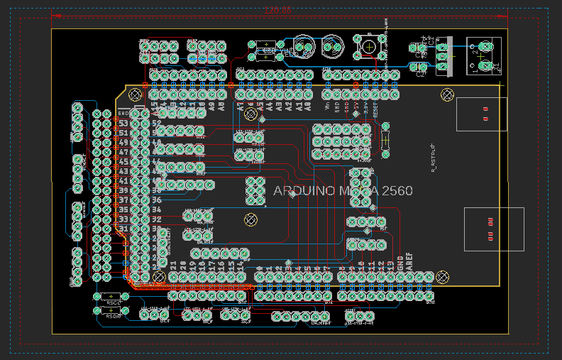
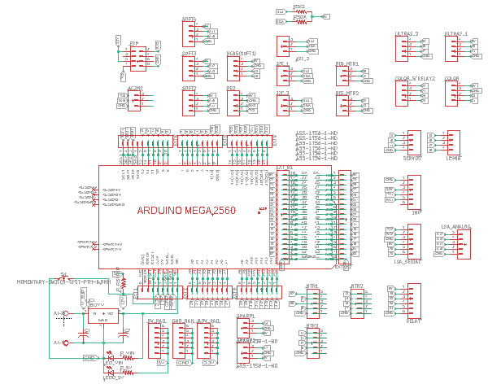

# Electronics-2

## Introduction
This repository contains the board design for Manual Bot Controller Shield for Arduino Mega 2560.

## Layout

### Board File -

### Schematic File -

## Files in the Repository
The files in the repository are :

#### ManualBot_Shield.brd
This is the Board file and contains the Blueprint of the Shield Layout (Prototype).

#### ManualBot_Shield.sch
This is the Schematic file and contains the actual circuitary behind the Shield.

#### README.md
The Description file containing details about the repository. The file that you looking at right now.

